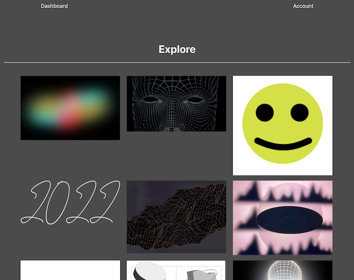

<h3 align="center">
	A MERN stack photo-sharing app.
</h3>
<p align="center">

</p>


<p align="center">
	<strong>
		<a href="https://photo-mode.herokuapp.com/" font-size="4rem">Deployed App</a>
		•
		<a href="https://github.com/MatteoThomas/photo-mode">Gihub Repo</a>
		•
		<a href="https://github.com/MatteoThomas">Github</a>
	</strong>
</p>

## clone or download
```terminal
$ git clone git@github.com:MatteoThomas/photo-mode.git
```

### Set environmental variables for the backend
	SECRET

	MONGODB_URI

	CLOUD_NAME

	CLOUD_KEY

	CLOUD_SECRET

### Start
```terminal
$ cd photomode // go to app folder
$ npm i // install packages
$ cd client // go to client folder
$ npm i // install packages
```


# Dependencies
| Front End  | Back End |
| ------------- | ------------- |
| react: 17.0.2 | mongoose: 5.13.7  |
| react-dotenv: 0.1.3  | express: 4.17.2  |
| @cloudinary/react: 1.0.1  | bcryptjs: 2.4.3  |
| @cloudinary/url-gen: 1.5.1  | body-parser: 1.19.1  |
| axios: 0.25.0  | cloudinary: 1.28.1  |
| styled-components: 5.3.3  | concurrently: 7.0.0  |
| framer-motion: 6.2.8  | cors: 2.8.5  |
| jsonwebtoken: 8.5.1  | dotenv: 14.2.0  |
| - | gridfs-stream: 1.1.1  |
| - | jsonwebtoken: 8.5.1  |
| - | multer: 1.4.4  |
| - | multer-gridfs-storage: 5.0.2  |
| - |nodemon: 2.0.15 |
| - | uuid: 8.3.2  |


# Screenshots of this project
<p align="left" >
	
</p>

## Bugs or Comments

[Create new Issues](https://github.com/MatteoThomas/photo-mode/issues) 

## Author
[Matthew Elliott](https://melliott.co/)

### License
[MIT](https://github.com/amazingandyyy/mern/blob/master/LICENSE)